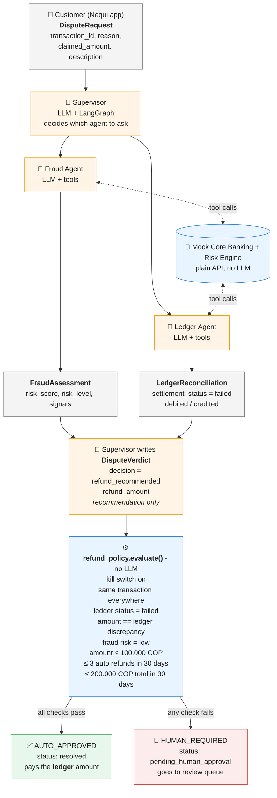

# nequi-bank-agent-demo

Proof-of-concept Dispute Triage & Resolution multi-agent system on AKS.

- Roadmap: [docs/ROADMAP.md](docs/ROADMAP.md)
- Architecture decisions: [docs/adr](docs/adr/README.md)

## How refunds are approved

The AI agents investigate and **recommend**; they can never approve or move money.
A deterministic policy (plain Python, no LLM) decides who approves, using facts from the
core banking ledger and risk engine ([ADR-0007](docs/adr/0007-tiered-refund-approval.md)).

🟧 Orange = LLM (probabilistic: investigates and recommends) · 🟦 Blue = deterministic code (decides) ·
⬜ Grey = validated Pydantic contracts ([field formats](shared/schemas.py))

Limits are configuration (`AUTO_REFUND_*` env vars), with a kill switch `AUTO_REFUND_ENABLED=false`.
